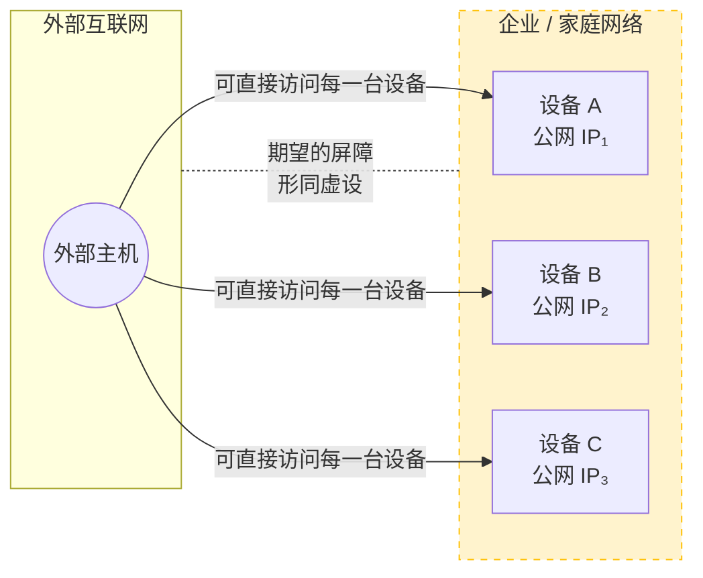
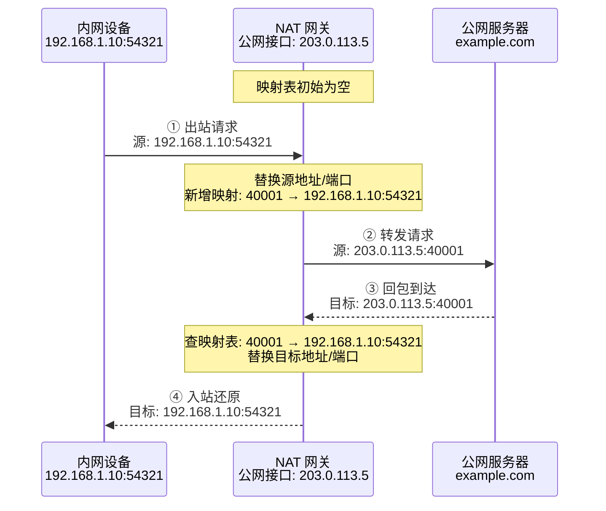
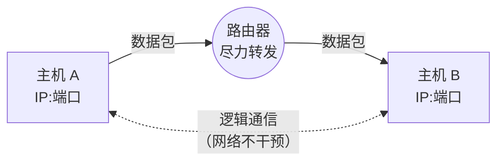

## 1. 简介
**NAT**，全称为**Network Address Translation**，中文名为==网络地址转换==。

从本质上来讲，它是路由器/防火墙的一项**基础网络功能**——是一种机制，而非某个特定工具。     
它的核心作用是让多台设备（手机、电脑、游戏主机）能够共享同一个公网 IP 访问互联网：将内网私有地址（如`192.168.x.x`）在出口处转换为公网地址。

跟Minecraft有什么关系？NAT的行为直接决定了**你的世界能否被好友发现，以及 P2P 联机能否成功建立。**

如果你用过一些P2P联机软件（比如自带联机功能的启动器、Radmin LAN等等），那么你可能对它并不陌生。

## 2. 起源

::: note
这个部分是为了便于理解NAT技术的设计理念，如不感兴趣则可略过
:::

这个就不得不从IPv4的机制说起了。

IPv4使用的是==32位的二进制数=={.warning}的地址，所以地址空间==只能提供约43亿个IP地址=={.warning}。但这连全球人口总数都达不到，更何况这些地址还要分配给来自全球各地不同的设备……

所以这点容量是远远不够的。

::: tip 什么是“32位二进制地址”？

一个 IPv4 地址在计算机内部就是一串**长度为32的 0/1 序列**，这个“0/1序列”就是**二进制**。  
为了方便人类阅读，通常把这32位分成 **4组**，每组 **8位**，再转成十进制，用点隔开——这就是我们常见的 `192.168.1.10` 格式。

```text
       32位二进制地址（共32个bit）
 ┌─────────┬─────────┬─────────┬─────────┐
 │  8 位   │  8 位   │  8 位   │  8 位   │   ← 4个八位组
 └─────────┴─────────┴─────────┴─────────┘
   11000000 . 10101000 . 00000001 . 00001010     ← 二进制表示
     192    .   168    .    1     .    10        ← 转换后的点分十进制
```

**可以这么理解**：32位 → 4 × 8位 → 每一个八位组可以表示 0~255 的十进制数。

那么地址容量是怎么算出来的呢？

别忘了，IPv4地址是二进制数地址，所以每一位只能是 **0 或 1** 两种状态。  
32位互相独立，总组合数就是 **2^32^**。

```text
    每一位： [0/1]  (2种可能)
    ┌─ 32位共有 ─────────────────┐
    │ 2 × 2 × 2 × …… × 2  （32个2相乘）
    └────────────────────────────┘
            = 2³²
            = 4,294,967,296
            ≈ 43 亿
```

这个 **约 43 亿** 就是 IPv4 地址的理论上限。
:::

而且，企业、家庭网络都希望内网拓扑对外部不可见，天然形成一道屏障。这个需求就是 **内网隔离需求**。

但是，IPv4根本无法满足这个需求……



**这样一来：**
1. 地址容量不足，不够用了
2. 内网隔离需求无法满足了

怎么办？不用怕，==私有地址==和==NAT技术==就是为了解决这些问题而诞生的标准答案。

IETF 在 RFC 1631 / 3022 中定义了 NAT，允许内部设备使用**私有地址（RFC 1918）**，出公网时再翻译为公共地址。

| 私有地址段 | 前缀表示 | 可用范围 |
| :--- | :--- | :--- |
| A 类 | `10.0.0.0/8` | 10.0.0.0 – 10.255.255.255 |
| B 类 | `172.16.0.0/12` | 172.16.0.0 – 172.31.255.255 |
| C 类 | `192.168.0.0/16` | 192.168.0.0 – 192.168.255.255 |

::: info
- **IETF 是谁？**  
IETF是**互联网工程任务组（Internet Engineering Task Force）**的简称，它是一个==开放的国际标准化组织==，负责制定和推广互联网相关的技术标准。

- **RFC 1631 / 3022 又是啥？**  
RFC 是 IETF 发布的==技术规范文档==，后面的数字对应==指定编号的RFC文档==。
    - RFC 1631 就是最早提出了网络地址转换（NAT）概念的文档。
    - RFC 3022 则是一个对传统NAT进行了更完整的定义与分类的文档。
:::

## 3. 工作原理

那么私有地址 + NAT 是如何同时解决“地址容量不足”、“内网隔离需求”这两个痛点的呢？

私有地址（RFC 1918）的设计思路其实很直接：**划出一块“只能在本地使用”的地址空间，让不同组织可以重复利用，而不占用公网地址资源。**  
这就好比公司内部的工位编号——A 公司的“工位 1”和 B 公司的“工位 1”不会冲突，因为它们根本不在同一套体系里。同理，无数个家庭网络都可以使用 `192.168.1.0/24`，但这些地址永远不会出现在公共互联网的路由表中。

```text
       A 公司体系                    B 公司体系
   ┌──────────────┐            ┌──────────────┐
   │   工位 1     │            │   工位 1     │
   │   工位 2     │            │   工位 2     │
   └──────────────┘            └──────────────┘
```

但光有私有地址还不够，因为这些设备需要访问公网，而私有地址在公网上是无法路由的。  
于是 **NAT（网络地址转换）** 承担了“翻译官”的角色，最常见的形式是 **NAPT（网络地址端口转换）**，工作方式如下：

1. **出站转换**：当内网设备（如 `192.168.1.10:54321`）发起对外请求时，NAT 网关将数据包的 **源私有地址 + 源端口** 替换为自己的 **公网地址 + 一个新的临时端口**（如 `203.0.113.5:40001`），并在内部维护一张 **映射表**。
2. **入站还原**：公网回包到达时，目标地址是 `203.0.113.5:40001`，NAT 查表找到对应的私有地址 `192.168.1.10:54321`，逆向替换后转发到内网设备。



这套机制就直接回应了最初的两大问题：

:::: card-grid
::: card title="① 地址容量不足？"
  借助 **端口多路复用**，一个公网 IP 可以同时承载数千个内网会话，使得“一个公网地址对应一个组织”变为可能，而非“一个地址对应一个设备”。私有地址在不同站点间大规模复用，将理论上的 43 亿地址扩展到了远超实际需求的规模。
:::
::: card title="② 内网隔离需求？"
  NAT 本质上是 **单向、有状态的转换**——只有从内网主动发起的会话才会创建映射，外部无法主动向内网发起连接（除非显式配置端口映射）。这就天然形成了一层“隐身屏障”：公网只能看到 NAT 网关的公网接口，内网拓扑与内部地址对外不可见，从而满足了网络边界的隔离与隐蔽性要求。
:::
::::
因此，**私有地址解决了“地址空间复用”，NAT 解决了“复用地址如何上网”，两者的结合既节省了公网 IPv4 地址，又构筑了基本的内网安全边界**，这正是它们作为 IPv4 过渡时代核心方案的根本原因。

::: info 来自IPv6时代的碾压
IPv6出现后，算是彻底解决了“地址容量不足”和“内网隔离需求”两大问题，因为IPv6采用128位地址，**总数高达2^128^个**，这是什么概念？**大约能在地球表面每平方米分配6.7×10^23^个地址**。设计上推崇**端到端连通性**，通过充足的地址空间消除了地址短缺这一NAT存在的根本理由，并用真正的**有状态防火墙**解决安全隔离问题。（尽管IPv6网络中仍存在NAT66等场景，但已非必需）。
:::

## 4. NAT类型 <Badge type="important" text="重要" />

NAT类型描述的**是路由器/防火墙对"外部主动入站连接"的放行策略**。它不是某种开关，而是一个**连续谱系**，从完全开放到完全封闭。

如果你要用P2P联机工具来进行联机的话（比如Radmin LAN或BakaXL联机大厅），那么**这将会成为你无法绕开的核心概念**，因为这个分类主要关注一个问题：

> 当一台外部电脑试图主动联系你时，路由器会不会帮它把包转交给你？

NAT类型的分类有着不同的依据，这里只列举最重要的两个。

### 4.1 通用分类（RFC 3489 标准）

从 P2P 应用（比如游戏、语音）的角度，NAT 的行为可以分为四类。根据NAT设备对**入站数据包**的过滤行为，RFC 3489（后被 RFC 5389/STUN 更新）定义了四种典型类型：

| NAT 类型 | 外部主机可发包条件 | 端口限制 | 对称性 |
|---------|-------------------|----------|-------|
| 全锥形 (Full Cone) | 知道映射地址即可 | 无限制 | 锥形 |
| 受限锥形 (Restricted Cone) | 内网曾给该 IP 发过包 | 不限制端口 | 锥形 |
| 端口受限锥形 (Port Restricted Cone) | 内网曾给该 IP:端口发过包 | 必须同一端口 | 锥形 |
| 对称型 (Symmetric) | 内网曾给该 IP:端口发过包 | 必须同一端口 | 对称 |

::: info 对称型与锥型的区别
- **锥形 NAT**：同一内网端点（IP:端口）的所有外发请求，无论目标是谁，都映射到**同一个公网端点**。
- **对称型 NAT**：同一内网端点向**不同目标端点（IP:端口）**发送时，会分配**不同的公网端口**。
:::

看不懂？那么如果按照下面这种分类方式来进行分类呢？

### 4.2 经典分类（Xbox/PlayStation 标准）

游戏主机厂商（微软、索尼）为了统一联机体验，将NAT简化为三级。这是你在路由器、游戏设置、P2P 软件中最常见的分类：

| NAT 类型 | 外部可发包条件 | 端口限制 | 对称性 |
|---------------------------|----------------|----------|--------|
| Open / Type 1 | 知道映射地址即可 | 无限制 | 锥形 |
| Moderate / Type 2 | 内网曾给该 IP 发过包（受限锥形）<br>内网曾给该 IP:端口 发过包（端口受限锥形） | 不限制端口（受限锥形）<br>必须同一端口（端口受限锥形） | 锥形 |
| Strict / Type 3 | 内网曾给该 IP:端口 发过包 | 必须同一端口 | 对称/<br>锥形 |

::: note
Open / Type 1：中文名为**开放（型）**，对应 **全锥形 (Full Cone)**

Moderate / Type 2：中文名为**中等（型）**，通常对应 **受限锥形 (Restricted Cone)** 和 **端口受限锥形 (Port Restricted Cone)**，具体取决于路由器实现

Strict / Type 3：中文名为**严格（型）**，对应 **端口受限锥形 (Port Restricted Cone)** 和 **对称型 (Symmetric)**
:::

### 4.3 有什么区别吗？

有的兄弟，有的，**这会直接关系到你的联机流畅度，甚至关系到你能不能联机。**

我们可以参考这张联机能力表格图，来找到指定NAT类型所对应的联机能力：

| NAT 类型 | 开房间给别人 | 加入别人的世界 | 能否直连 | 需要中继吗？ |
| :--- | :---: | :---: | :---: | :---: |
| **Open（开放）** | ✅ 完美 | ✅ 完美 | 是 | 不用 |
| **Moderate（中等）** | ⚠️ 可能可以 | ✅ 通常可以 | 有运气成分 | 有时需要 |
| **Strict（严格）** | ❌ 几乎不行 | ⚠️ 可能可以 | 你连个毛 | 必须中继 |

开放型NAT是最容易打洞成功的，反之，严格型NAT是最不好打洞或者说是联机成功率最低的。

::: tip 为什么严格型NAT很难联机？

举个例子，内网 `192.168.1.2:5000` 访问 `8.8.8.8:80` 时它会映射为 `203.0.113.5:60001`；访问 `9.9.9.9:80` 时又会映射为 `203.0.113.5:60002`。

一个端口号是`60001`，另一个又变成了`60002`，外部主机 **根本无法预先知道** 对方会为本次会话分配哪个端口，所以天然无法完成 UDP 打洞。

这样一来，连朋友的入口都找不着，更别提要“碰一面”了。

:::

## 5. NAT的一些问题

如果你对网络技术有一定的了解，那么经过上文的阅读之后你就会发现，NAT这项技术其实跟**端到端原则**有冲突，因为它破坏了这个原则。

::: info
**端到端原则（End-to-End Principle）**，也叫“**端对端**”，是==互联网设计的核心思想之一==，简单说就是：路由器仅尽力转发，不关心内容；所有应用逻辑、状态维护和可靠性由终端自行处理，网络保持简单无状态。主机只需知道对方 IP 和端口即可直接通信，网络不干预。


:::

当然，这是技术层面上的坑点，如果下放到用户层面，那可就显而易见了……

### 5.1 P2P直连障碍

我们需要知道的是，在理想的情况下，==任何两台拥有公网地址的主机都可以直接向对方发起连接==，这是端到端原则的基石。    

但 NAT 的出现==让内网主机能够主动“出去”，却阻止了外网主机主动“进来”=={.warning}。

原因在于，NAT 设备（通常是路由器）在内存中维护着一张 **NAT 映射表**（或称转换表）：

```text
NAT 映射表 (当前状态)
---------------------------------------------------------
| 内网地址:端口          | 公网地址:端口        | 目标地址:端口   |
---------------------------------------------------------
| 192.168.1.5:45000      | 203.0.113.5:55000   | 8.8.8.8:53     |
| 192.168.1.5:45001      | 203.0.113.5:55001   | 1.2.3.4:8080   |
---------------------------------------------------------
```
给大家解读一下：只有当外网回包的目的端口精确匹配 `55000` 或 `55001` 时，NAT 才会转发给内网主机。否则报文直接被丢弃——因为 NAT 不知道该把它交给哪台内网设备。**这就是“外网无法主动敲门”的根本原因**。

如果你看过了之前那张NAT类型的表格，那么我们可以直接把原表格中的NAT类型搬到这里来解释：

| NAT 类型 | 映射条件 | 外网可连接性 |
|----------|----------|---------------|
| **全锥形 (Full Cone)** | 只要源 IP:端口 固定，任何外部主机都能回连 | ★★★ 最容易穿透 |
| **受限锥形 (Restricted Cone)** | 只有内网先发过数据的外部IP，其任何端口都可回连 | ★★☆ 需要先“打招呼” |
| **端口受限锥形 (Port Restricted Cone)** | 只有内网先发过数据的外部 IP:端口 才能回连 | ★☆☆ 穿透困难 |
| **对称型 (Symmetric)** | 不同目标 IP:端口 会分配不同公网端口 | ☆☆☆ 几乎必须中继 |

这样一来，那些P2P应用的直连障碍就这么产生了。两台都在各自 NAT 后面的主机，谁也无法主动连接到对方。

这种环境下要怎么实现联机呢？那你就必须得靠**外部辅助**了：

1. **要么**：中心服务器中转。
2. **要么**：借助 STUN/TURN 等 NAT 穿透协议，通过预测端口行为来“打洞”（UDP hole punching）。

要是碰上对称型NAT嘛……走中继服务器吧，不然没戏。

### 5.2 应用层协议与NAT的冲突

问题不止在 IP 层。

早期不少应用协议在设计时，根本没有考虑 NAT 的存在，==它们在应用层载荷里直接塞入了内网IP地址或端口=={.warning}。当数据包经过 NAT 时，只有IP头部和传输层头部的地址被转换，应用层数据原封不动，对端拿到的就是毫无意义的内网地址，连接自然失败。

举个例子：

**原始 FTP 控制连接数据（主动模式）**：
```text
客户端 -> 服务器 (PORT 命令)
PORT 192,168,1,5,12,34
```
服务器收到后会尝试连接 `192.168.1.5:3106`，但这是内网IP，显然不可达。

**经过 NAT 上的 FTP ALG 改写后**：
```text
客户端 -> 服务器 (已被 NAT 修改的 PORT 命令)
PORT 203,0,113,5,55,0
```
同时 NAT 动态添加映射：`203.0.113.5:55000 ←→ 192.168.1.5:3106`，这样一来，连接才能被建立。

同样，SIP/SDP 的改写也可以用表格总结：

| 协议 | 嵌入内网地址的字段 | 需要 ALG 改写的内容 |
|------|-------------------|---------------------|
| FTP  | `PORT` 命令参数 | 替换 ASCII 编码的 IP 与端口 |
| SIP  | SDP 中的 `c=` 行和 `m=` 行 | 修改 RTP 接收地址为公网 IP，并建立 RTP 端口映射 |
| DNS  | 某些响应包里的“本地 DNS 服务器 IP” | 若内网 DNS 被暴露，需改写为公网或移除 |

emmm……这对于大部分普通用户来说可能不太好理解，这里拿MC的下界高速机制做个比喻：

```yaml
# 没有 ALG 的后果
接收方拿到的坐标: (1000, 64, -500) # 主世界坐标
实际到达的位置: 下界 (1000, 64, -500) # 错误

# ALG 自动换算
改写后的坐标: (1000/8, 64, -500/8) = (125, 64, -62)
实际到达的位置: 正确对应主世界的位置
```

### 5.3 安全隐患

NAT满足了内网隔离需求后，很多普通用户都以为它是一种安全手段（类似于防火墙），以为“藏在路由器后面，外面就扫不到我”。

这是一种常见的误解——==将默认拒绝入站连接误认为是一种安全体系=={.warning}，但真正的安全依赖的是**状态检测防火墙（Stateful Firewall）**和**访问控制列表（ACL）**。

对照一下：

| 功能/能力 | NAT | 状态检测防火墙 |
|-----------|-----|----------------|
| 地址转换 | ✔️ 默认动作 | ✔️ 可配合使用 |
| 跟踪 TCP 状态（SYN/ACK/序列号校验） | ❌ 不检查 | ✔️ 严格验证 |
| 深度载荷检测（DPI） | ❌ 无 | ✔️ 可识别攻击签名 |
| 按照规则过滤（ACL） | ❌ 无（仅靠映射表隐式拒绝） | ✔️ 灵活自定义 |
| 防 UPnP 恶意开放端口 | ❌ 被动接受请求 | ✔️ 可禁止 UPnP 或白名单授权 |

什么意思？意思就是NAT它根本不“理解”流量，只是机械地转发。这是它的**防御漏洞**。

::: warning
NAT 本身==不是一种安全手段=={.warning}。RFC 2663 明确指出 NAT 不能替代防火墙。内网主机一旦通过 UPnP 主动开放端口，NAT 就会毫无保留地暴露服务。
:::

如果你不理解有什么具体威胁，那么你可以看看下面这些例子：

- 如果内网游戏主机请求开放 `25565` 端口，NAT 就会照做，进而导致对外直接暴露Minecraft服务器的端口。
- NAT 不检查 TCP 报文内容的，攻击者可以在 HTTP 会话中携带恶意代码，NAT 全部放行。
- NAT 不会过滤 DNS 查询，内网主机可能会泄露请求的域名，暴露业务结构（商战）。

::: tip
还是不理解？就好比你喝了隐身药水，却忽略了**监守者能靠声音振动来追踪你的位置**，因为监守者本来就看不见，你隐不隐身对它根本不起任何作用。

隐身只是隐藏了你的模型渲染，你的脚步声、手持物品、身上中的箭、药水的粒子效果依然会暴露你的位置。想要防御外敌，就不能靠隐身这种“治标不治本”的办法来防御，而是用一套好的装备和一个盾牌来保护自己。
:::

### 5.4 超时断连

NAT 设备的映射表资源是有限的，为了服务更多连接，==它会主动回收长时间没有流量的映射=={.warning}，尤其是对无连接状态的 UDP 协议。

UDP 不像 TCP 那样有明确的握手和挥手，NAT 只能根据“最后一次看到数据包的时间”来猜测这条通信是否还活着。一旦超时（常见的家用路由器可能只有 30 到 180 秒），映射条目就会被删除。

```text
T0: 内网主机 192.168.1.5:45000 向公网服务器发送第一个 UDP 包
     ↓
T1: NAT 创建映射 (192.168.1.5:45000 ↔ 203.0.113.5:55000)，计时器开始倒计时（默认 60 秒）
     ↓
T0+30s: 最后一次收到回包，计时器重置为 60 秒
     ↓
T0+90s: 双方沉默，无任何数据包刷新映射
     ↓
T0+120s: 计时器归零，NAT 删除该映射条目。通信“洞”崩塌。
     ↓
T0+125s: 公网对端尝试向 203.0.113.5:55000 发送数据 → NAT 找不到匹配条目 → 丢弃
```

怎么办呢？有个解决方案是**心跳包策略**：

```python
# 游戏客户端的 UDP 心跳逻辑 (伪代码)
import socket, time

sock = socket.socket(socket.AF_INET, socket.SOCK_DGRAM)
server_addr = ('game.server.com', 27015)

while True:
    # 实际游戏操作...
    send_game_data(sock, server_addr)
    
    # 每 20 秒强制发送一个空载荷心跳包，刷新 NAT 映射
    time.sleep(20)
    sock.sendto(b'KEEPALIVE', server_addr)
```

这里的 `KEEPALIVE` 的机制类似于Minecraft服务端定期ping客户端（玩家延迟信息更新）

::: info
Minecraft基岩版（Bedrock）使用UDP协议，其内置的Connected Ping/Pong机制（ RakNet协议层面 ）可持续刷新NAT映射，这是应用层对NAT超时的补偿案例。
:::

## 6. NAT的技术栈

为了让应用能在 NAT 环境里工作，业界发展出了一整套技术栈。下面只展示最重要的几种。

- **手动端口映射**  
  在路由器管理界面配置，将公网特定端口直接转发到内网主机。  
  *示例（路由器后台界面逻辑，非真实命令）：*  
  ```text
  协议：TCP/UDP
  外部端口：25565
  内部 IP：192.168.1.10
  内部端口：25565
  描述：Minecraft Server
  ```

- **UPnP（通用即插即用）**  
  允许内网程序 **自动请求** 路由器添加端口映射。Minecraft 客户端内置了这一功能。  
  ```text
  客户端发送 UPnP 请求 → 路由器添加临时端口转发 → 外部可直连
  ```

- **STUN（Session Traversal Utilities for NAT）**  
  客户端向公网 STUN 服务器发送查询，得到自己“映射后的公网 IP 和端口”以及 **NAT 类型**。  
  *这是打洞决策的第一步。*

- **TURN（Traversal Using Relays around NAT）**  
  所有流量经过公网 **中继服务器** 转发。  
  ⚠️ 保证 100% 连通，但成本高、延迟大，是万不得已的备选。

- **ICE（Interactive Connectivity Establishment）**  
  综合以上所有方式，**自动选出最佳路径**：先尝试直连，再试 STUN 打洞，最终退回 TURN。WebRTC 就是典型应用。

- **UDP 打洞（UDP Hole Punching）**  
  双方向信令服务器交换映射地址后，同时向对方的公网地址发包，在非对称 NAT 上大概率可以建立直连。