## 1. 简介
**NAT**，全称为**Network Address Translation**，中文名为==网络地址转换==。

从本质上来讲，它是路由器/防火墙的一项**基础网络功能**——是一种机制，而非某个特定工具。     
它的核心作用是让多台设备（手机、电脑、游戏主机）能够共享同一个公网 IP 访问互联网：将内网私有地址（如`192.168.x.x`）在出口处转换为公网地址。

跟Minecraft有什么关系？NAT的行为直接决定了**你的世界能否被好友发现，以及 P2P 联机能否成功建立。**

如果你用过一些P2P联机软件（比如自带联机功能的启动器、Radmin LAN等等），那么你可能对它并不陌生。

## 2. 起源

::: note
这个部分是为了便于理解NAT技术的设计理念，如不感兴趣则可略过
:::

这个就不得不从IPv4的机制说起了。

IPv4使用的是==32位的二进制数=={.warning}的地址，所以地址空间==只能提供约43亿个IP地址=={.warning}。但这连全球人口总数都达不到，更何况这些地址还要分配给来自全球各地不同的设备……

所以这点容量是远远不够的。

::: tip 什么是“32位二进制地址”？

一个 IPv4 地址在计算机内部就是一串**长度为32的 0/1 序列**，这个“0/1序列”就是**二进制**。  
为了方便人类阅读，通常把这32位分成 **4组**，每组 **8位**，再转成十进制，用点隔开——这就是我们常见的 `192.168.1.10` 格式。

```text
       32位二进制地址（共32个bit）
 ┌─────────┬─────────┬─────────┬─────────┐
 │  8 位   │  8 位   │  8 位   │  8 位   │   ← 4个八位组
 └─────────┴─────────┴─────────┴─────────┘
   11000000 . 10101000 . 00000001 . 00001010     ← 二进制表示
     192    .   168    .    1     .    10        ← 转换后的点分十进制
```

**可以这么理解**：32位 → 4 × 8位 → 每一个八位组可以表示 0~255 的十进制数。

那么地址容量是怎么算出来的呢？

别忘了，IPv4地址是二进制数地址，所以每一位只能是 **0 或 1** 两种状态。  
32位互相独立，总组合数就是 **2^32^**。

```text
    每一位： [0/1]  (2种可能)
    ┌─ 32位共有 ─────────────────┐
    │ 2 × 2 × 2 × …… × 2  （32个2相乘）
    └────────────────────────────┘
            = 2³²
            = 4,294,967,296
            ≈ 43 亿
```

这个 **约 43 亿** 就是 IPv4 地址的理论上限。
:::

而且，企业、家庭网络都希望内网拓扑对外部不可见，天然形成一道屏障。这个需求就是 **内网隔离需求**。

但是，IPv4根本无法满足这个需求……

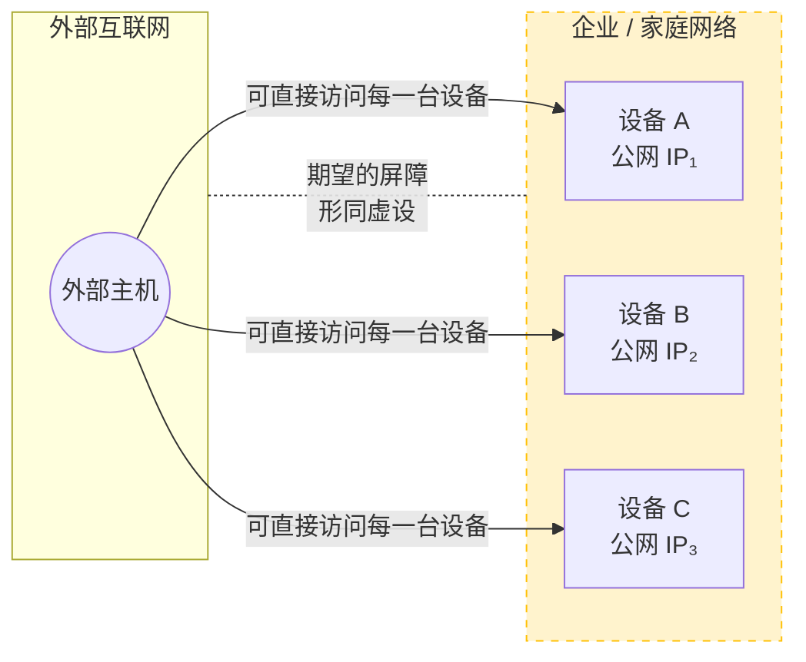

**这样一来：**
1. 地址容量不足，不够用了
2. 内网隔离需求无法满足了

怎么办？不用怕，==私有地址==和==NAT技术==就是为了解决这些问题而诞生的标准答案。

IETF 在 RFC 1631 / 3022 中定义了 NAT，允许内部设备使用**私有地址（RFC 1918）**，出公网时再翻译为公共地址。

| 私有地址段 | 前缀表示 | 可用范围 |
| :--- | :--- | :--- |
| A 类 | `10.0.0.0/8` | 10.0.0.0 – 10.255.255.255 |
| B 类 | `172.16.0.0/12` | 172.16.0.0 – 172.31.255.255 |
| C 类 | `192.168.0.0/16` | 192.168.0.0 – 192.168.255.255 |

::: info
- **IETF 是谁？**  
IETF是**互联网工程任务组（Internet Engineering Task Force）**的简称，它是一个==开放的国际标准化组织==，负责制定和推广互联网相关的技术标准。

- **RFC 1631 / 3022 又是啥？**  
RFC 是 IETF 发布的==技术规范文档==，后面的数字对应==指定编号的RFC文档==。
    - RFC 1631 就是最早提出了网络地址转换（NAT）概念的文档。
    - RFC 3022 则是一个对传统NAT进行了更完整的定义与分类的文档。
:::

## 3. 工作原理

那么私有地址 + NAT 是如何同时解决“地址容量不足”、“内网隔离需求”这两个痛点的呢？

私有地址（RFC 1918）的设计思路其实很直接：**划出一块“只能在本地使用”的地址空间，让不同组织可以重复利用，而不占用公网地址资源。**  
这就好比公司内部的工位编号——A 公司的“工位 1”和 B 公司的“工位 1”不会冲突，因为它们根本不在同一套体系里。同理，无数个家庭网络都可以使用 `192.168.1.0/24`，但这些地址永远不会出现在公共互联网的路由表中。

```text
       A 公司体系                    B 公司体系
   ┌──────────────┐            ┌──────────────┐
   │   工位 1     │            │   工位 1     │
   │   工位 2     │            │   工位 2     │
   └──────────────┘            └──────────────┘
```

但光有私有地址还不够，因为这些设备需要访问公网，而私有地址在公网上是无法路由的。  
于是 **NAT（网络地址转换）** 承担了“翻译官”的角色，最常见的形式是 **NAPT（网络地址端口转换）**，工作方式如下：

1. **出站转换**：当内网设备（如 `192.168.1.10:54321`）发起对外请求时，NAT 网关将数据包的 **源私有地址 + 源端口** 替换为自己的 **公网地址 + 一个新的临时端口**（如 `203.0.113.5:40001`），并在内部维护一张 **映射表**。
2. **入站还原**：公网回包到达时，目标地址是 `203.0.113.5:40001`，NAT 查表找到对应的私有地址 `192.168.1.10:54321`，逆向替换后转发到内网设备。

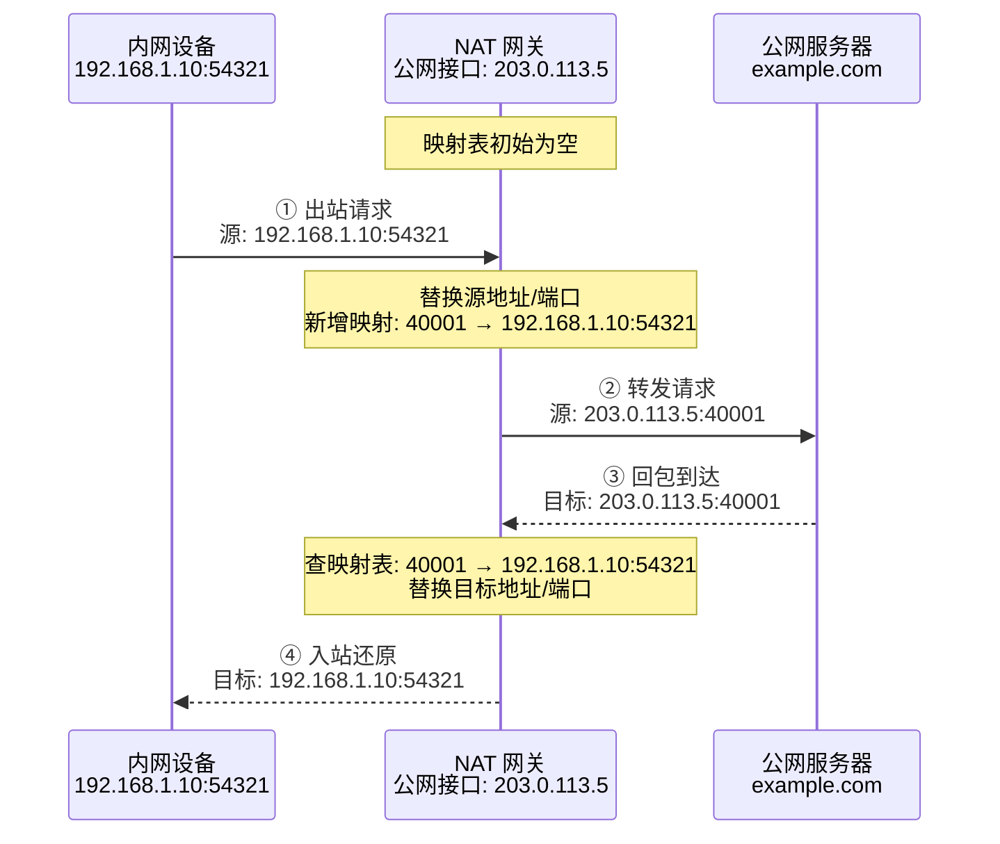

这套机制就直接回应了最初的两大问题：

:::: card-grid
::: card title="① 地址容量不足？"
  借助 **端口多路复用**，一个公网 IP 可以同时承载数千个内网会话，使得“一个公网地址对应一个组织”变为可能，而非“一个地址对应一个设备”。私有地址在不同站点间大规模复用，将理论上的 43 亿地址扩展到了远超实际需求的规模。
:::
::: card title="② 内网隔离需求？"
  NAT 本质上是 **单向、有状态的转换**——只有从内网主动发起的会话才会创建映射，外部无法主动向内网发起连接（除非显式配置端口映射）。这就天然形成了一层“隐身屏障”：公网只能看到 NAT 网关的公网接口，内网拓扑与内部地址对外不可见，从而满足了网络边界的隔离与隐蔽性要求。
:::
::::
正是因为这样，**私有地址解决了“地址空间复用”，NAT 解决了“复用地址如何上网”，两者的结合既节省了公网 IPv4 地址，又构筑了基本的内网安全边界**，这正是它们作为 IPv4 过渡时代核心方案的根本原因。

::: tip 一个小伏笔
如果你回头再看一遍上面的流程，会发现 NAT 的转换其实有**两个方向**：

- **从内网到外网**：修改的是数据包的**源地址**（你的内网IP → 路由器的公网IP）
- **从外网到内网**：修改的是数据包的**目的地址**（路由器的公网IP → 你的内网IP）

这两个方向，后面我们会分别叫做 **SNAT** 和 **DNAT**。先记住名字，具体含义后面细讲。
:::

::: info 来自IPv6时代的碾压
IPv6出现后，算是彻底解决了“地址容量不足”和“内网隔离需求”两大问题，因为IPv6采用128位地址，**总数高达2^128^个**，这是什么概念？**大约能在地球表面每平方米分配6.7×10^23^个地址**。不仅如此，它的设计上推崇**端到端连通性**，通过充足的地址空间消除了地址短缺这一NAT存在的根本理由，并用真正的**有状态防火墙**解决安全隔离问题。（尽管IPv6网络中仍存在NAT66等场景，但已非必需）。
:::

## 4. NAT类型 <Badge type="important" text="重要" />

NAT类型描述的**是路由器/防火墙对"外部主动入站连接"的放行策略**。它不是某种开关，而是一个**连续谱系**，从完全开放到完全封闭。

如果你要用P2P联机工具来进行联机的话（比如Radmin LAN或BakaXL联机大厅），那么**这将会成为你无法绕开的核心概念**，因为这个分类主要关注一个问题：

> 当一台外部电脑试图主动联系你时，路由器会不会帮它把包转交给你？

NAT类型的分类有着不同的依据，这里只列举最重要的两个。

### 4.1 通用分类（RFC 3489 标准）

从 P2P 应用（比如游戏、语音）的角度，NAT 的行为可以分为四类。根据NAT设备对**入站数据包**的过滤行为，RFC 3489（后被 RFC 5389/STUN 更新）定义了四种典型类型：

| NAT 类型 | 外部主机可发包条件 | 端口限制 | 对称性 |
|---------|-------------------|----------|-------|
| 全锥形 (Full Cone) | 知道映射地址即可 | 无限制 | 锥形 |
| 受限锥形 (Restricted Cone) | 内网曾给该 IP 发过包 | 不限制端口 | 锥形 |
| 端口受限锥形 (Port Restricted Cone) | 内网曾给该 IP:端口发过包 | 必须同一端口 | 锥形 |
| 对称型 (Symmetric) | 内网曾给该 IP:端口发过包 | 必须同一端口 | 对称 |

::: info 对称型与锥型的区别
- **锥形 NAT**：同一内网端点（IP:端口）的所有外发请求，无论目标是谁，都映射到**同一个公网端点**。
- **对称型 NAT**：同一内网端点向**不同目标端点（IP:端口）**发送时，会分配**不同的公网端口**。
:::

看不懂？那么如果按照下面这种分类方式来进行分类呢？

### 4.2 经典分类（Xbox/PlayStation 标准）

游戏主机厂商（微软、索尼）为了统一联机体验，将NAT简化为三级。这是你在路由器、游戏设置、P2P 软件中最常见的分类：

| NAT 类型 | 外部可发包条件 | 端口限制 | 对称性 |
|---------------------------|----------------|----------|--------|
| Open / Type 1 | 知道映射地址即可 | 无限制 | 锥形 |
| Moderate / Type 2 | 内网曾给该 IP 发过包（受限锥形）<br>内网曾给该 IP:端口 发过包（端口受限锥形） | 不限制端口（受限锥形）<br>必须同一端口（端口受限锥形） | 锥形 |
| Strict / Type 3 | 内网曾给该 IP:端口 发过包 | 必须同一端口 | 对称/<br>锥形 |

::: note
Open / Type 1：中文名为**开放（型）**，对应 **全锥形 (Full Cone)**

Moderate / Type 2：中文名为**中等（型）**，通常对应 **受限锥形 (Restricted Cone)** 和 **端口受限锥形 (Port Restricted Cone)**，具体取决于路由器实现

Strict / Type 3：中文名为**严格（型）**，对应 **端口受限锥形 (Port Restricted Cone)** 和 **对称型 (Symmetric)**
:::

### 4.3 有什么区别吗？

有的兄弟，有的，**这会直接关系到你的联机流畅度，甚至关系到你能不能联机。**

我们可以参考这张联机能力表格图，来找到指定NAT类型所对应的联机能力：

| NAT 类型 | 开房间给别人 | 加入别人的世界 | 能否直连 | 需要中继吗？ |
| :--- | :---: | :---: | :---: | :---: |
| **Open（开放）** | ✅ 完美 | ✅ 完美 | 是 | 不用 |
| **Moderate（中等）** | ⚠️ 可能可以 | ✅ 通常可以 | 有运气成分 | 有时需要 |
| **Strict（严格）** | ❌ 几乎不行 | ⚠️ 可能可以 | 否 | 必须中继 |

开放型NAT是最容易打洞成功的，反之，严格型NAT是最不好打洞或者说是联机成功率最低的。

::: tip 为什么严格型NAT很难联机？

举个例子，内网 `192.168.1.2:5000` 访问 `8.8.8.8:80` 时它会映射为 `203.0.113.5:60001`；访问 `9.9.9.9:80` 时又会映射为 `203.0.113.5:60002`。

一个端口号是`60001`，另一个又变成了`60002`，外部主机 **根本无法预先知道** 对方会为本次会话分配哪个端口，所以天然无法完成 UDP 打洞。

这样一来，连朋友的入口都找不着，更别提要“碰一面”了。

:::

## 5. NAT的一些问题

如果你对网络技术有一定的了解，那么经过上文的阅读之后你就会发现，NAT这项技术其实跟**端到端原则**有冲突，因为它破坏了这个原则。

::: info
**端到端原则（End-to-End Principle）**，也叫“**端对端**”，是==互联网设计的核心思想之一==，简单说就是：路由器仅尽力转发，不关心内容；所有应用逻辑、状态维护和可靠性由终端自行处理，网络保持简单无状态。主机只需知道对方 IP 和端口即可直接通信，网络不干预。

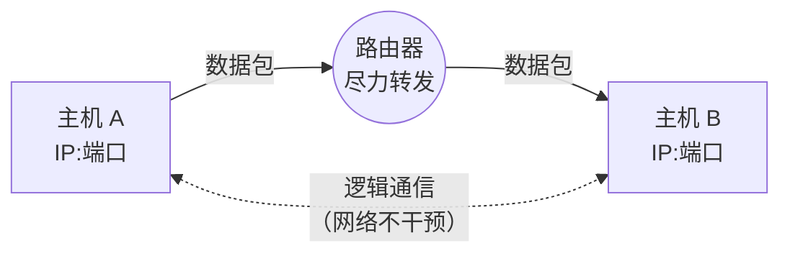
:::

当然，这是技术层面上的坑点，如果下放到用户层面，那可就显而易见了……

### 5.1 P2P直连障碍

我们需要知道的是，在理想的情况下，==任何两台拥有公网地址的主机都可以直接向对方发起连接==，这是端到端原则的基石。    

但 NAT 的出现==让内网主机能够主动“出去”，却阻止了外网主机主动“进来”=={.warning}。

原因在于，NAT 设备（通常是路由器）在内存中维护着一张 **NAT 映射表**（或称转换表）：

```text
NAT 映射表 (当前状态)
---------------------------------------------------------
| 内网地址:端口          | 公网地址:端口        | 目标地址:端口   |
---------------------------------------------------------
| 192.168.1.5:45000      | 203.0.113.5:55000   | 8.8.8.8:53     |
| 192.168.1.5:45001      | 203.0.113.5:55001   | 1.2.3.4:8080   |
---------------------------------------------------------
```
给大家解读一下：只有当外网回包的目的端口精确匹配 `55000` 或 `55001` 时，NAT 才会转发给内网主机。否则报文直接被丢弃——因为 NAT 不知道该把它交给哪台内网设备。**这就是“外网无法主动敲门”的根本原因**。

::: note
在[4.3节](#_4-3-有什么区别吗)中我们已经列过不同 NAT 类型的联机能力，这里不再重复。

核心结论记住一点：**两台 Strict NAT 后面的主机，谁也无法主动连上对方**。
:::

这样一来，那些P2P应用的直连障碍就这么产生了。两台都在各自 NAT 后面的主机，谁也无法主动连接到对方。

这种环境下要怎么实现联机呢？那你就必须得靠**外部辅助**了：

1. **要么**：中心服务器中转。
2. **要么**：借助 STUN/TURN 等 NAT 穿透协议，通过预测端口行为来“打洞”（UDP hole punching）。

要是碰上对称型NAT嘛……走中继服务器吧，不然没戏。

### 5.2 应用层协议与NAT的冲突

问题不止在 IP 层。

早期不少应用协议在设计时，根本没有考虑 NAT 的存在，==它们在应用层载荷里直接塞入了内网IP地址或端口=={.warning}。当数据包经过 NAT 时，只有IP头部和传输层头部的地址被转换，应用层数据原封不动，对端拿到的就是毫无意义的内网地址，连接自然失败。

举个例子：

**原始 FTP 控制连接数据（主动模式）**：
```text
客户端 -> 服务器 (PORT 命令)
PORT 192,168,1,5,12,34
```
服务器收到后会尝试连接 `192.168.1.5:3106`，但这是内网IP，显然不可达。

**经过 NAT 上的 FTP ALG 改写后**：
```text
客户端 -> 服务器 (已被 NAT 修改的 PORT 命令)
PORT 203,0,113,5,55,0
```
同时 NAT 动态添加映射：`203.0.113.5:55000 ←→ 192.168.1.5:3106`，这样一来，连接才能被建立。

同样，SIP/SDP 的改写也可以用表格总结：

| 协议 | 嵌入内网地址的字段 | 需要 ALG 改写的内容 |
|------|-------------------|---------------------|
| FTP  | `PORT` 命令参数 | 替换 ASCII 编码的 IP 与端口 |
| SIP  | SDP 中的 `c=` 行和 `m=` 行 | 修改 RTP 接收地址为公网 IP，并建立 RTP 端口映射 |
| DNS  | 某些响应包里的“本地 DNS 服务器 IP” | 若内网 DNS 被暴露，需改写为公网或移除 |

emmm……这对于大部分普通用户来说可能不太好理解，这里拿MC的下界高速机制做个比喻：

```yaml
# 没有 ALG 的后果
接收方拿到的坐标: (1000, 64, -500) # 主世界坐标
实际到达的位置: 下界 (1000, 64, -500) # 错误

# ALG 自动换算
改写后的坐标: (1000/8, 64, -500/8) = (125, 64, -62)
实际到达的位置: 正确对应主世界的位置
```

### 5.3 安全隐患

NAT满足了内网隔离需求后，很多普通用户都以为它是一种安全手段（类似于防火墙），以为“藏在路由器后面，外面就扫不到我”。

这是一种常见的误解——==将默认拒绝入站连接误认为是一种安全体系=={.warning}，但真正的安全依赖的是**状态检测防火墙（Stateful Firewall）**和**访问控制列表（ACL）**。

对照一下：

| 功能/能力 | NAT | 状态检测防火墙 |
|-----------|-----|----------------|
| 地址转换 | ✔️ 默认动作 | ✔️ 可配合使用 |
| 跟踪 TCP 状态（SYN/ACK/序列号校验） | ❌ 不检查 | ✔️ 严格验证 |
| 深度载荷检测（DPI） | ❌ 无 | ✔️ 可识别攻击签名 |
| 按照规则过滤（ACL） | ❌ 无（仅靠映射表隐式拒绝） | ✔️ 灵活自定义 |
| 防 UPnP 恶意开放端口 | ❌ 被动接受请求 | ✔️ 可禁止 UPnP 或白名单授权 |

什么意思？意思就是NAT它根本不“理解”流量，只是机械地转发。这是它的**防御漏洞**。

::: danger
NAT 本身==不是一种安全手段=={.warning}。RFC 2663 明确指出 NAT 不能替代防火墙。内网主机一旦通过 UPnP 主动开放端口，NAT 就会毫无保留地暴露服务。
:::

如果你不理解有什么具体威胁，那么你可以看看下面这些例子：

- 如果内网游戏主机请求开放 `25565` 端口，NAT 就会照做，进而导致对外直接暴露Minecraft服务器的端口。
- NAT 不检查 TCP 报文内容的，攻击者可以在 HTTP 会话中携带恶意代码，NAT 全部放行。
- NAT 不会过滤 DNS 查询，内网主机可能会泄露请求的域名，暴露业务结构（商战）。

::: tip
还是不理解？就好比你喝了隐身药水，却忽略了**监守者能靠声音振动来追踪你的位置**，因为监守者本来就看不见，你隐不隐身对它根本不起任何作用。

隐身只是隐藏了你的模型渲染，你的脚步声、手持物品、身上中的箭、药水的粒子效果依然会暴露你的位置。想要防御外敌，就不能靠隐身这种“治标不治本”的办法来防御，而是用一套好的装备和一个盾牌来保护自己。
:::

### 5.4 超时断连

NAT 设备的映射表资源是有限的，为了服务更多连接，==它会主动回收长时间没有流量的映射=={.warning}，尤其是对无连接状态的 UDP 协议。

UDP 不像 TCP 那样有明确的握手和挥手，NAT 只能根据“最后一次看到数据包的时间”来猜测这条通信是否还活着。一旦超时（常见的家用路由器可能只有 30 到 180 秒），映射条目就会被删除。

```text
T0: 内网主机 192.168.1.5:45000 向公网服务器发送第一个 UDP 包
     ↓
T1: NAT 创建映射 (192.168.1.5:45000 ↔ 203.0.113.5:55000)，计时器开始倒计时（默认 60 秒）
     ↓
T0+30s: 最后一次收到回包，计时器重置为 60 秒
     ↓
T0+90s: 双方沉默，无任何数据包刷新映射
     ↓
T0+120s: 计时器归零，NAT 删除该映射条目。通信“洞”崩塌。
     ↓
T0+125s: 公网对端尝试向 203.0.113.5:55000 发送数据 → NAT 找不到匹配条目 → 丢弃
```

怎么办呢？有个解决方案是**心跳包策略**：

```python
# 游戏客户端的 UDP 心跳逻辑 (伪代码)
import socket, time

sock = socket.socket(socket.AF_INET, socket.SOCK_DGRAM)
server_addr = ('game.server.com', 27015)

while True:
    # 实际游戏操作...
    send_game_data(sock, server_addr)
    
    # 每 20 秒强制发送一个空载荷心跳包，刷新 NAT 映射
    time.sleep(20)
    sock.sendto(b'KEEPALIVE', server_addr)
```

这里的 `KEEPALIVE` 的机制类似于Minecraft服务端定期ping客户端（玩家延迟信息更新）

::: info
Minecraft基岩版（Bedrock）使用UDP协议，其内置的Connected Ping/Pong机制（ RakNet协议层面 ）可持续刷新NAT映射，这是应用层对NAT超时的补偿案例。
:::

## 6. 其他NAT变体

前面聊的基本都是“内网主动上网”时 NAT 怎么转换地址，在工作原理那一节，我们讲的是NAPT的工作原理，其中还有几位成员，你很可能每天都在用，却叫不上名字。搞懂它们，是理解为什么需要第7节那一整套技术栈的前提。

### 6.1 SNAT与DNAT

我们一直在说 NAT 改地址，但**改的是源地址还是目标地址？** 答案取决于数据包的**方向**。

基于这种理论，我们便可以很好的理解SNAT和DNAT：

- **SNAT（Source NAT）**指的就是**修改数据包的源IP地址**（在绝大多数场景下还会同时修改源端口）
- **DNAT（Destination NAT）**指的就是**修改数据包的目标IP地址**（通常也会修改目的端口）

这里用一张表格来快速区分：

| 类型 | 转换方向 | 修改的头部字段 | 典型场景 |
|------|---------|--------------|---------|
| **SNAT** (Source NAT) | 内网 → 外网 | 源IP、源端口 | 多台设备共享公网IP上网 |
| **DNAT** (Destination NAT) | 外网 → 内网 | 目的IP、目的端口 | 端口映射、公网访问内网服务器 |

现在回头看[第3节](#_3-工作原理)的NAPT工作原理：“出站转换”就是**SNAT**，“入站还原”就是**DNAT的逆过程**；     
而[第7.1节](#_7-1-手动端口映射)要讲的手动端口映射，本质上就是在路由器里写一条DNAT规则。

SNAT 的工作原理如图所示：

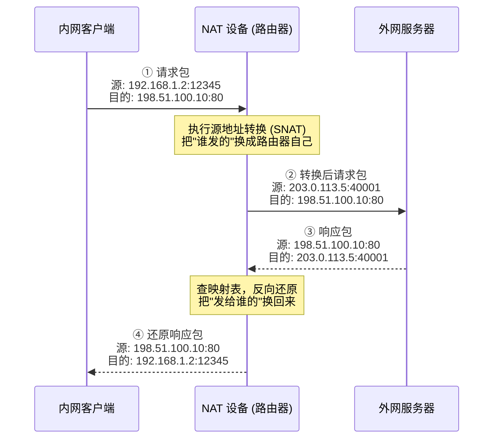

DNAT 的工作原理则为：

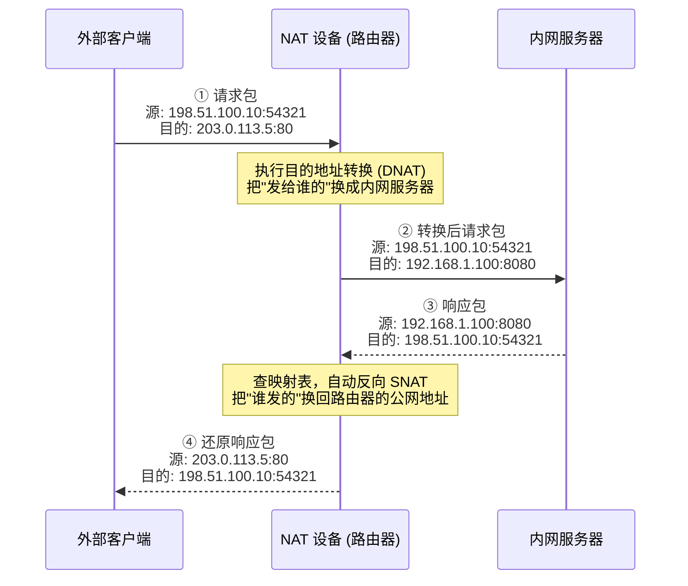

### 6.2 CGNAT

::: important
这是国内玩家联机踩坑的重灾区，请仔细阅读。
:::

**CGNAT**，全称 **Carrier-Grade NAT（运营商级NAT）**，由 RFC 6598 定义，运营商通常使用 `100.64.0.0/10`（共享地址空间）或普通私有地址段作为内部地址。

::: note
判断 CGNAT 的关键不是看具体数字，而是**看你的路由器 WAN 口 IP 是否与公网 IP 不一致**。
:::

简单点说就是：**运营商没有足够的公网 IPv4 地址分给你，于是它自己先架了一台巨型 NAT 设备，把你家和邻居都塞里面。**这样一来，你的路由器已经是第二层NAT了。

```text
你的电脑 → 你的路由器 (第1层NAT) → 运营商CGNAT设备 (第2层NAT) → 公网
 192.168.1.x     10.x.x.x 或 100.x.x.x        真正的公网IP
```

但这就会直接导致一个问题：**当你遇到NAT类问题而无法进行P2P联机时，你再怎么捣鼓你的路由器设置，外面的朋友还是连不进来。** 因为数据包在到达你的路由器之前，先被运营商的 CGNAT 设备拦住了——那台设备上没有为你做端口映射的规则，直接丢弃。

**CGNAT 用户数据流（地址与端口变化）**：
```text
    用户侧             家庭NAT (第1层)       CGNAT网关 (第2层)      公网侧
192.168.1.2:1111 ──→ 100.64.0.10:40001 ──→ 203.0.113.5:50001 ──→ Internet
192.168.1.3:2222 ──→ 100.64.0.10:40002 ──→ 203.0.113.5:50002 ──→ Internet
```

**CGNAT 内部维护的地址映射表（NAT Table）**：
```
Private (CGNAT内部)      Public (公网)
─────────────────────────────────────
100.64.0.10:40001     203.0.113.5:50001
100.64.0.10:40002     203.0.113.5:50002
```

这就好比你在家把卧室门打开了，但小区的大门还锁着，你朋友依然进不来。!!估计你的朋友已经准备问候你了!!

::: tip
**如何判断自己是否被 CGNAT？**

1. 进入路由器后台，查看 WAN 口（或上网设置）获取到的 IP 地址；然后打开浏览器访问 [ip.sb](https://ip.sb) 或 [ip138.com](http://ip138.com) 查看你“在公网的 IP”。如果**两个 IP 不一致**，几乎可以确定你被 CGNAT 了。
2. 如果你的路由器 WAN 口 IP 落在 `100.64.0.0/10`（100.64.0.0 – 100.127.255.255）范围内，铁定是 CGNAT。

**有什么解决办法？**

- 打电话给运营商，申请将宽带改为“**公网IP**”（部分地区是可以免费办理的，理由可以说“家里装监控”或“玩游戏需要”）。
- 使用IPv6直连。目前主流宽带都已提供IPv6地址，IPv6与IPv4是两个独立的网络。即使你的IPv4被CGNAT，只要双方都拥有IPv6地址，就可以通过IPv6直接通信，完全不受CGNAT影响，能实现真正的端到端。
- 使用TURN中继服务器，或支持转发的联机工具（如樱花frp、Radmin LAN等），让流量从中继节点绕一圈，只是这种办法的延迟会比P2P直连高出许多，而且还可能需要一点💰。
:::
### 6.3 NAT Hairpin

我们假设一个场景：你在家搭了个MC服务器，内网地址是 `192.168.1.10`，并在路由器上做了端口映射：公网 `203.0.113.5:25565` → 内网 `192.168.1.10:25565`。

你的朋友在另一个城市通过 `203.0.113.5:25565` 能顺利连上。而你这边处于同一个 Wi-Fi 下的室友，却**用同样的公网地址怎么也连不上**。

**这是为什么？**因为数据包从你电脑发出，目标地址是路由器的公网接口 `203.0.113.5`。路由器收到后感到困惑：“这个包是发给我的公网地址的，但内网那个服务器也是我自己管的，我是把它扔到公网去绕一圈，还是直接扔回内网？”

许多家用路由器默认的处理方式是——**丢掉**，因为它不知道该走哪条路。

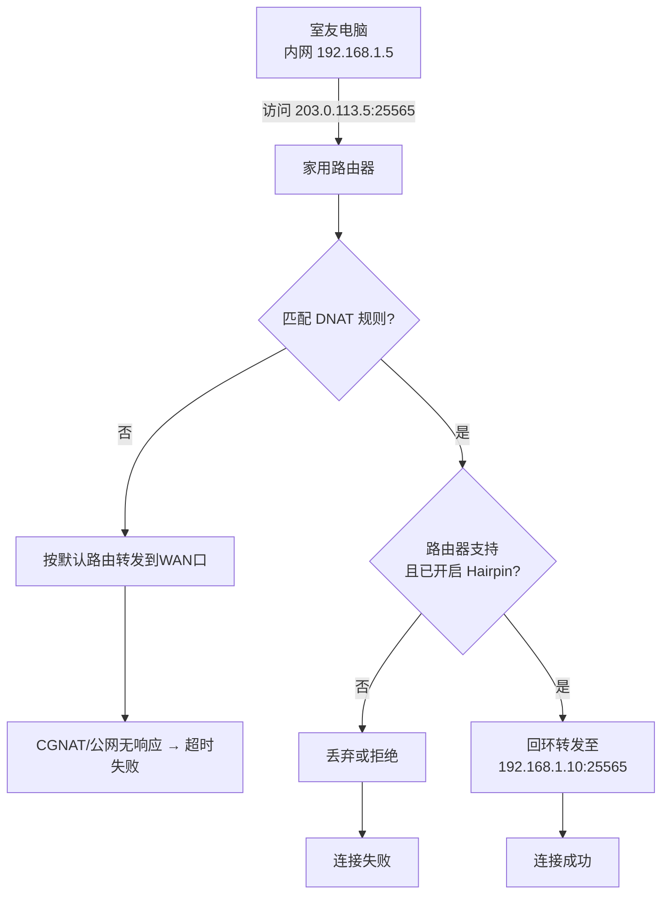

这种现象就叫 **NAT Hairpin**（也叫 **NAT Loopback** 或 **NAT Reflection**，三个名字指同一回事）。

**解决方案（三选一）：**

1. 既然你和室友都在同一局域网，为什么不直接让他连 `192.168.1.10:25565` 呢？这样子做的延迟是最低的。
2. 登录路由器后台，找找有没有 “NAT Loopback”、“NAT Reflection” 或 “NAT回环” 开关，打开即可（部分品牌如华硕、TP-Link 高端型号支持）。
3. 在电脑的 hosts 文件里把域名（如果有）强行解析到内网 IP `192.168.1.10`，这样虽然输的是域名，实际走内网。

::: important
同一个网络下你就用内网IP，别折腾公网地址。
:::

## 7. NAT的技术栈

为了让应用能在 NAT 环境里工作，业界发展出了一整套技术栈。

它的核心目标就是**让位于不同NAT设备后的主机能够建立直接的P2P通信，或者至少能通过某种方式实现端到端的数据传输**。

下面按从**手动到自动、从直连到中继**的顺序展开。

### 7.1 手动端口映射

这是最原始、最可靠、也是最麻烦的办法。

它的原理就是==直接在路由器里写一条静态DNAT规则==——把公网某个端口的入站流量，固定转发到内网某台设备的某个端口。这是在[6.1节](#_6-1-snat与dnat)就已经提到的 **DNAT 规则的典型应用**。

::: note 本地电脑架设MC服务器
举个例子，在本地电脑开MC服务器的时候，如果要通过手动端口映射来让异地朋友进入你的服务器，那么你在路由器的设置就是这样的：
```yaml
协议: TCP/UDP
外部端口: 25565
内部 IP: 192.168.1.10
内部端口: 25565
描述: Minecraft Server
```
如果你在家用台式机搭了个Java版服务器，想让外网好友直连。只要你的宽带是公网 IP，那手动映射就是最稳的方案
:::

**优点：**
- 一旦配置完成，该服务就是完全可达的，而且也不依赖额外的第三方设备或软件。
- 性能没有任何损耗
- 不受 UPnP 漏洞影响（后面会讲）

**缺点：**
- 纯手动
- 需要**固定内网IP**（因为路由器重启之后，内网设备的IP就会变，规则随之失效）
- 每台路由器后台界面不同
- 如果运营商给你的是CGNAT（见[6.2节](#_6-2-cgnat)），手动映射毫无意义（你开的是卧室门，但小区大门还锁着）

### 7.2 UPnP
手动映射太麻烦了，而且我还根本不了解如何配置路由器，该怎么办呢？——试试UPnP？

::: info
通用即插即用（英语：Universal Plug and Play，简称UPnP）是由“通用即插即用论坛”（UPnP™ Forum）推广的一套网络协议。该协议的目标是使家庭网络（数据共享、通信和娱乐）和公司网络中的各种设备能够相互无缝连接，并简化相关网络的实现。UPnP通过定义和发布基于开放、因特网通讯网协议标准的UPnP设备控制协议来实现这一目标。UPnP的基本组件为服务、设备和控制点。
:::

它的原理就是内网程序（比如 Minecraft 客户端、启动器、BT 软件）通过UPnP协议==自动向路由器发送请求==。路由器如果支持且开启了 UPnP，就会自动添加一条临时的端口转发规则。

这里可以用一段聊天记录来抽象化理解这个原理（左边为BakaXL启动器，右边为路由器）：

::: chat title="启动器与路由器"
{BakaXL}
在吗？

{.}
有事直说

{BakaXL}
帮我开一下`25565`端口呗？

{BakaXL}
映射到这台电脑的`192.168.1.10:25565`

{.}
彳亍

{.}
我先看看UPnP开了没

{.}
（查看ing……）好像开了？

{.}
OK呀那我这边也是直接给你上了一条转发规则了好吧

{BakaXL}
谢谢😉

{BakaXL}
Ciallo～ (∠・ω< )⌒★
:::

**原理图：**


**优点：**
- 用户不需要手动操作，程序会自己搞定
- 映射是动态的，程序关闭后通常会自动删除

**缺点：**
- ==任何内网程序都能请求开端口，恶意软件也能利用这一点暴露你的内网服务=={.danger}。RFC 2663 明确警告过这一点，我们在[5.3节](#_5-3-安全隐患)也提到过。
- 很多路由器默认关闭UPnP，或者虽然有选项但实现有BUG
- 同样受 CGNAT 限制（UPnP 只能控制你的路由器，控制不了运营商的 CGNAT）

::: tip
HMCL、PCL2、BakaXL等启动器的联机功能的底层很多都依赖 UPnP 自动开洞。如果你创建房间后发现外网朋友连不进来，建议先检查路由器是否开启了UPnP
:::

### 7.3 STUN

手动映射和 UPnP 都是“让外面能连进来”的办法。但如果两台都在 NAT 后面的主机想直连，它们首先需要知道自己在公网长什么样——这就是STUN。

::: info
STUN（Session Traversal Utilities for NAT，NAT会话穿越应用程序）是一种网络协议，它允许位于NAT（或多重NAT）后的客户端找出自己的公网地址，查出自己位于哪种类型的NAT之后以及NAT为某一个本地端口所绑定的Internet端端口。这些信息被用来在两个同时处于NAT路由器之后的主机之间创建UDP通信。该协议由RFC 5389定义。
:::

它的原理相对简单，客户端向公网的 STUN 服务器发送一个 UDP 探测包。STUN 服务器收到后，把**它看到的你的公网 IP 和端口**原样返回给你。

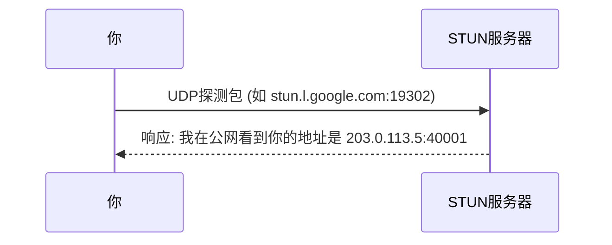

这样，通过对比**自己认为的内网地址**和**STUN告诉你的公网地址**，那么客户端就可以推断出：
1. 我自己是不是在 NAT 后面？
2. NAT 是什么类型？（Open/Moderate/Strict，见[第4节](#_4-nat类型)）
3. 我自己的“公网入口”长什么样呢？

如果连自己在哪都不知道，怎么让对端找到你？所以==这是打洞决策的第一步==。

那**缺点**呢？没有**局限性**吗？有的兄弟，有的：
- STUN 它只能探测和告知，不能帮你建立连接，就好比雷达能帮你扫描但不能帮你直接打击目标 =D
- 有个需要注意的地方就是，在**对称型NAT**下，==STUN 测出的端口只对本次查询的目标（即 STUN 服务器）有效=={.warning}。当你换了一个目标主机去连接时，NAT 会分配**完全不同的端口**（见[4.3节](#_4-3-有什么区别吗)），所以 STUN 信息对打洞帮助有限

::: tip 你知道吗
很多启动器在创建房间前会自动访问 STUN 服务器，就是为了先摸清自己的 NAT 底细，再决定下一步怎么走。
:::

### 7.4 TURN

什么？你说 STUN 探测完发现你的NAT类型是“严格（Strict）”？没事还有救，NAT 的技术栈还留了一手——它就是 **TURN**。

::: info
TURN（全称Traversal Using Relays around NAT）是IETF制定的RFC 5766标准协议，属于NAT穿透技术的一种实现方案。该协议通过中继服务器转发TCP/UDP数据流，在直接P2P连接失败时为客户端建立通信通道，作为STUN协议扩展集成于ICE框架。其核心组件包含TURN服务器、客户端及中继传输地址，支持安全认证机制与SSL/TLS加密传输。
:::

它的原理更简单了，就是==所有流量不再尝试直连，全部经过一台公网中继服务器转发=={.warning}。你和对方都把数据发给 TURN 服务器，TURN 服务器负责在你们之间搬运数据包。

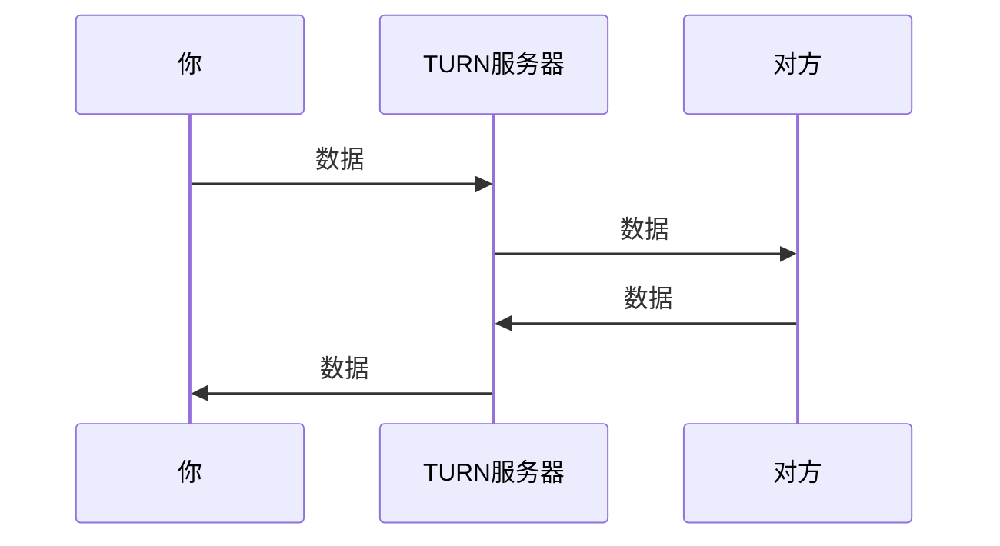

**这个理解起来相当简单！**通俗点讲就是：TURN服务器作为一个红绿灯路口，你要找朋友串门，得先过这个红绿灯路口（等红灯），才能到朋友家，这比直接走过去还要多花一些时间。

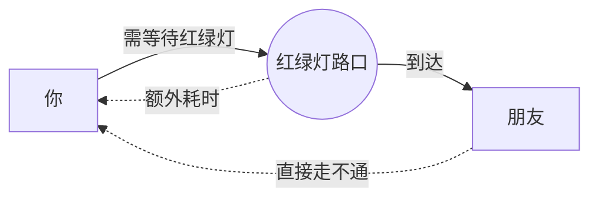

这玩意的强度可不一般，==在TURN服务器可达的前提下，能绕过几乎所有NAT的限制！==

穿透力这么强，那么**代价**肯定是有的：
- 数据绕了一圈，物理距离增加，**延迟就会翻倍**
- 中继服务器要承担双倍流量（收一份、发一份），运营方需要花钱，所以**免费服务通常有带宽或时长限制**
- 流量是需要经过第三方服务器的，虽然通常是加密的，但==理论上中继节点是能看到元数据的=={.warning}，所以**不能保障用户隐私**

### 7.5 ICE
STUN 和 TURN 都有了，但程序怎么知道**先用哪个、什么时候切换？**总不能让用户手动选择吧？——ICE出现了！

::: info
交互式连接创建（Interactive Connectivity Establishment，ICE）是一种综合性的NAT穿透技术，由IETF的MMUSIC工作组开发，通过集成STUN、TURN和SDP协议帮助设备在复杂网络环境中建立点对点连接，广泛应用于WebRTC、SIP客户端等实时通信场景。
:::

ICE 是一个**框架**而不是一种具体的协议（像UPnP、STUN那种）。它把前面所有手段（直连、STUN 打洞、TURN 中继）打包成一个**候选路径列表**，然后按优先级逐个尝试：

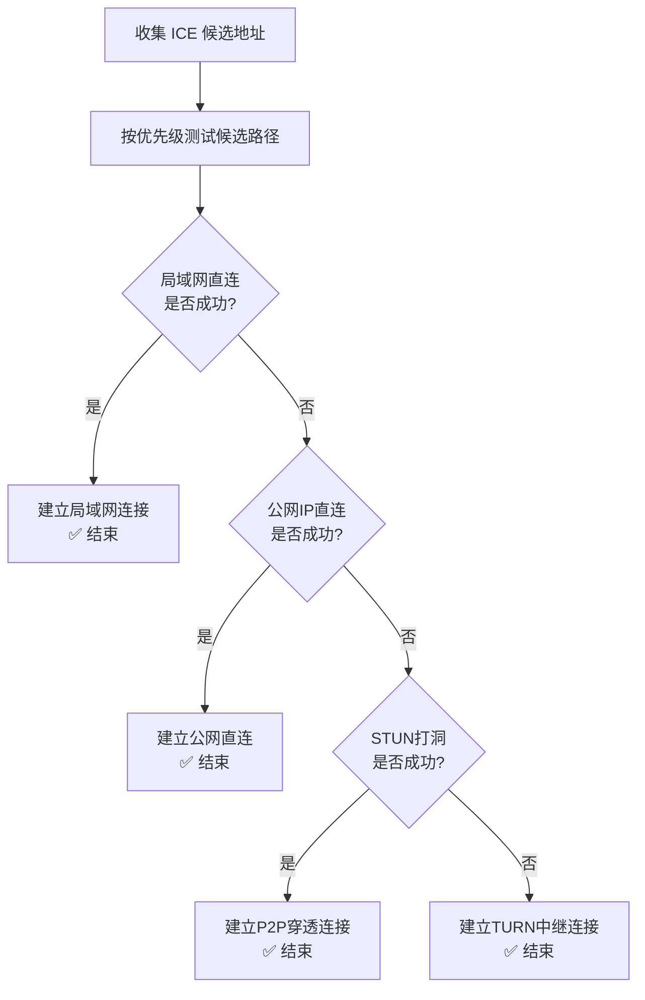

ICE 会==自动测试每条路径的连通性和延迟==，然后选择**最优**的那条建立连接。整个过程是透明可见的。

::: note 实际应用
WebRTC（浏览器视频通话、在线会议）就是基于 ICE 的。你打微信视频、开腾讯会议，底层都是 ICE 在帮你选路。
:::
::: tip
如果你用的联机工具支持“自动选择最佳连接方式”，底层大概率就是 ICE 或简化版的 ICE 逻辑。
:::

### 7.6 UDP打洞 <Badge type="important" text="重要" />

这是 P2P 联机的**核心方法**，也是 STUN + ICE 框架中最关键的一步。

::: info
UDP打洞（UDP hole punching）是一种基于第三方服务器的NAT穿越技术，主要用于实现不同私有网络中主机的点对点直接UDP通信。该技术通过协调客户端获取NAT映射的公网地址和端口信息，在圆锥型NAT环境下建立双向数据传输通道，但无法适配对称型NAT设备。其核心应用场景包括P2P软件、互联网协议语音电话（VoIP）及部分虚拟专用网络连接。
:::

它的原理就是两台都在 NAT 后面的主机通过**信令服务器**（一个双方都能访问的公网中介）交换各自的公网地址（由 STUN 测得）。然后，双方**同时**向对方的公网地址发送 UDP 数据包。

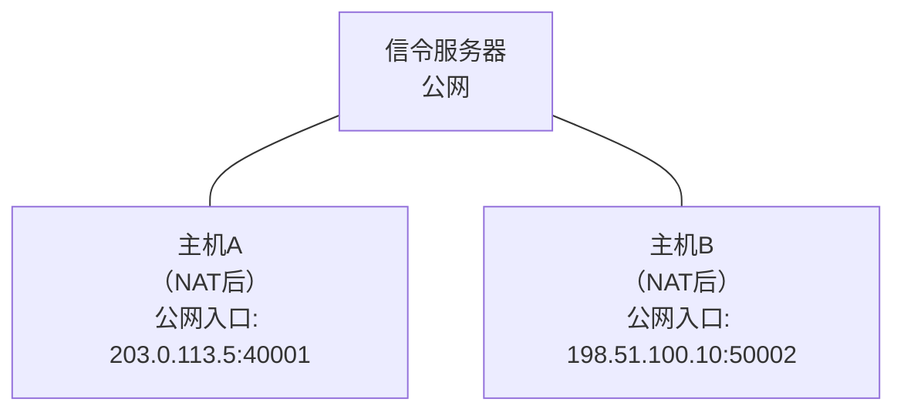

步骤如下：
::: timeline
- 第一步

  A 和 B 分别向信令服务器注册，获取对方公网地址

- 第二步

  A 向 198.51.100.10:50002 发 UDP 包

- 第三步

  B 向 203.0.113.5:40001 发 UDP 包

- 第四步

  双方 NAT 设备看到"内网主动向外发包"，创建/刷新映射

- 第五步

  对方的包到达时，NAT 认为"这是刚才那趟会话的回包"，放行！
:::

::: note 为什么叫"打洞"？
回到上面的第五步，我们可以把NAT的映射表想象成一堵墙，内网主动发包相当于在墙上凿了一个临时通道（洞）。双方同时凿，洞对上了，数据就能穿过去。
:::

**成功率**

| NAT 类型 | 评价 |
|----------|------|
| 全锥形/受限锥形 NAT | ★★★ 很高 |
| 端口受限锥形 NAT | ★★☆ 需要端口预测，成功率下降 |
| 对称型 NAT | ★☆☆ 几乎不可能，因为每次目标不同端口就不同（见[4.3节](#_4-3-有什么区别吗)） |

::: tip 你知道吗
Radmin LAN、部分启动器的P2P直连功能，底层核心机制就是UDP打洞。你和好友能直连而不卡，大概率就是打洞成功了。
:::

### 7.7 技术栈关系总览

如果你仔细想想，就会发现：这些东西根本就不是互相替代的关系，而是一种**层层兜底**的关系。

```text
┌─────────────────────────────────────────────────────────┐
│  第一层：直连优先                                        │
│  ├─ 同一局域网 → 直接用内网IP（0延迟）                    │
│  └─ 一方有公网IP → 直连对方公网地址                      │
├─────────────────────────────────────────────────────────┤
│  第二层：自动开洞（UPnP）*                               │
│  └─ 程序请求路由器自动映射端口 → 外部可直连               │
├─────────────────────────────────────────────────────────┤
│  第三层：STUN + UDP打洞（ICE框架）                       │
│  ├─ STUN 探测公网地址和NAT类型                           │
│  ├─ 信令服务器交换地址                                   │
│  └─ 双方同时发包打洞 → 建立直连                          │
├─────────────────────────────────────────────────────────┤
│  第四层：TURN中继（保底方案）                              │
│  └─ 所有流量走公网中继服务器 → 100%连通，但延迟高           │
└─────────────────────────────────────────────────────────┘

* UPnP 属于端口映射技术，与 ICE 框架并行使用，而非 ICE 内部候选路径。
```

总而言之就是，==能直连就不中继，能打洞就不映射，能自动就不手动==。这是 NAT 技术栈的设计哲学。

## 8. 查看自己的NAT类型

理论都看完了，NAT类型也知道是什么意思了，但是我们要怎么查看自己的NAT类型呢？

::: steps

1. **本地软件**

    如果要得到一个较为准确的检测结果，那么首选方案肯定是本地程序的。这里推荐使用[NatTypeTester](https://github.com/HMBSbige/NatTypeTester)（开源，基于 STUN 协议，直接给出NAT类型的结论）

    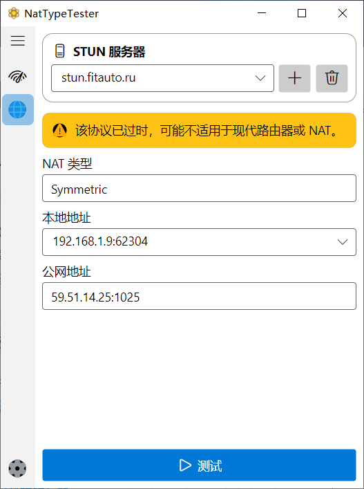

    当然，很多附带P2P联机功能的启动器（如BakaXL）自带网络检测功能，也能直观显示NAT类型。

    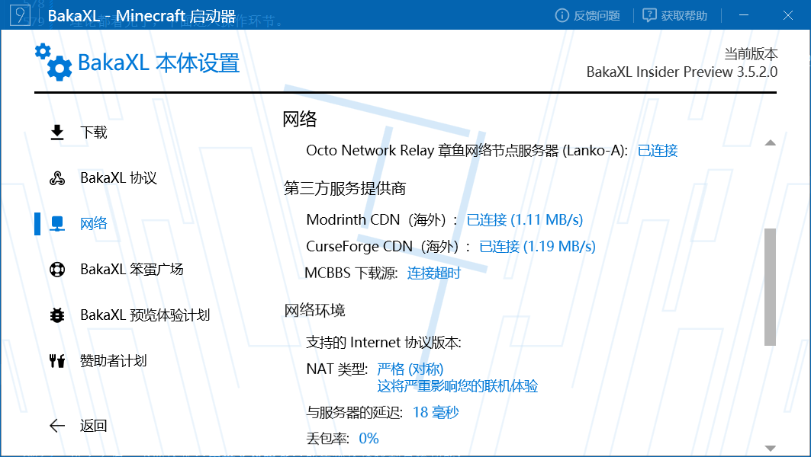

2. **测试网页**

    网上也有一部分STUN测试网页，==但纯网页无法完成完整的UDP打洞检测==，可靠性比较低，建议优先使用本地程序。

3. **路由器**

    大多数家用路由器的后台可以通过浏览器访问以下**常见地址**进入（具体以路由器底部标签为准）：
    `192.168.1.1` 或 `192.168.0.1` 或 `miwifi.com`（小米）等。

    进去之后，下面这张**中英文对照表**能帮你快速找到目标功能：

    | 你要做的事 | 常见中文名称 | 常见英文名称 |
    |-----------|------------|-------------|
    | 手动端口映射 | 虚拟服务器 / 端口转发 / 端口映射 | Port Forwarding / Virtual Server |
    | 开启NAT回环 | NAT回环 / NAT环回 | NAT Loopback / Hairpin NAT |
    | 关闭防火墙测试 | 防火墙设置 / 安全设置 | Firewall / Security |
    | 开启UPnP | UPnP设置 / 即插即用 | UPnP / IGD |

    **主流品牌菜单位置速查：**

    - **TP-Link**：登录后→“应用管理”→“虚拟服务器”→添加映射规则。
    - **小米 / Redmi 路由器**：小米WiFi APP / 网页后台→“高级设置”→“端口转发”→“添加规则”。
    - **华硕 (ASUS)**：左侧菜单“WAN”→“虚拟服务器/端口转发”→“开启端口转发”→添加。同时华硕通常有“NAT Loopback”开关，在“防火墙”或“WAN”设置中。
    - **华为 / 荣耀**：华为智慧生活APP→路由器→“更多功能”→“网络设置”→“端口映射”。

:::

## 9. 常见问题

如果你的朋友无法加入你的世界，或者你连不上别人的服务器时，按照这个顺序一步一步排查，就不用盲目试错了：

```text
0. (可选捷径)双方都支持 IPv6 吗？
   └─ 是 → 直接用 IPv6 地址连接，跳过以上所有 NAT 问题。
   └─ 否 → 继续按以下步骤排查。
      ↓
1. 确认双方都能正常上网
   └─ 浏览器打开百度都正常？基础网络没问题。
      ↓
2. 检查自己的NAT类型
   └─ 用 NatTypeTester 测一下。
   └─ 如果是 Symmetric（对称），下两步是重点。
      ↓
3. 检查是否被 CGNAT
   └─ 路由器WAN口IP ≠ 访问 ip.sb 看到的IP？
   └─ 或者 WAN口IP是 100.64.x.x ~ 100.127.x.x？
        ↓ 是 → 联系运营商申请公网IP，或改用IPv6 / 中继工具。
        ↓ 否 → 继续下一步。
      ↓
4. 检查路由器端口映射 / UPnP 是否生效
   └─ 如果是自建服务器：确认映射规则的内网IP和端口完全正确（尤其是TCP/UDP协议要选对）。
   └─ 如果用联机工具：确保路由器开启了 UPnP，或工具已提示“端口映射成功”。
      ↓
5. 尝试内网直连测试（排除 Hairpin 和服务器本身问题）
   └─ 让同寝舍友直接用你的内网 IP（如 192.168.1.10:25565）连接。
   └─ 内网能连上、公网连不上 → 问题出在端口映射、CGNAT 或 Hairpin。
   └─ 内网也连不上 → 
      ├─ 确认服务器已启动且监听 0.0.0.0（而非 127.0.0.1）
      ├─ 检查本机防火墙是否放行 Minecraft/Java
      └─ 检查服务器配置文件中的端口是否正确
      ↓
6. 确认防火墙/杀毒软件未拦截
   └─ 临时关闭 Windows Defender 防火墙或第三方安全软件，再试。
   └─ 别忘了 Java（MC Java版）或 Minecraft 本体也需要被防火墙放行。
      ↓
7. 以上全部失败 → 使用 TURN 中继或第三方联机工具
   └─ 比如 Radmin LAN、樱花 frp、OpenFrp 等，它们会通过中继节点转发流量。
   └─ 这能确保100%连通，只是延迟会比直连高一点。
```

::: tip
如果你和朋友的宽带都支持 IPv6，直接用 IPv6 地址连接可以**彻底绕过以上所有 NAT 问题**。在服务器属性里把 IPv6 地址发给好友即可（注意：Windows 自带的防火墙里需要放行 Minecraft 的入站规则）。
:::